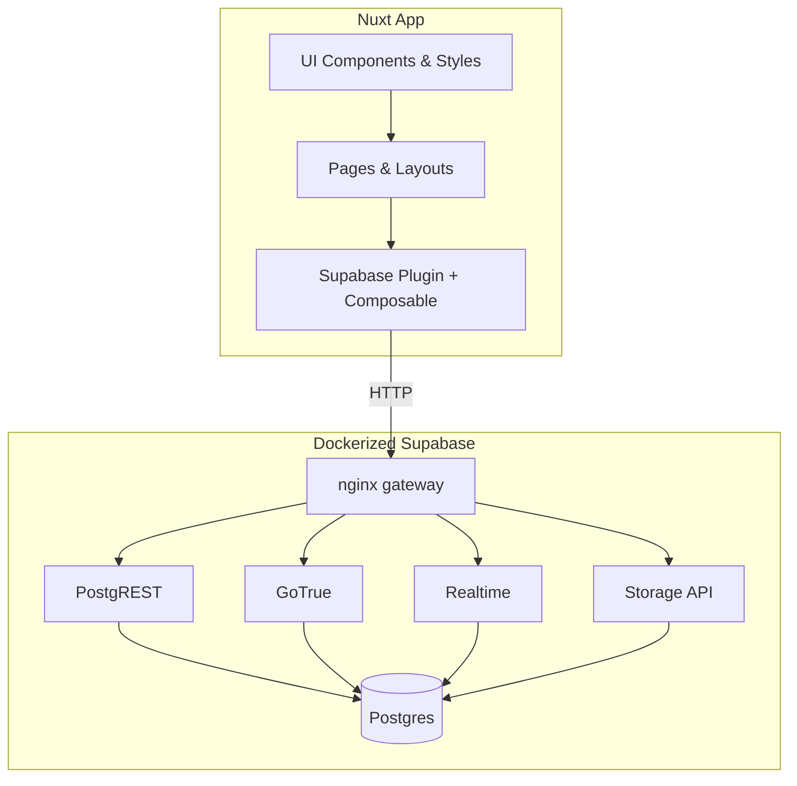
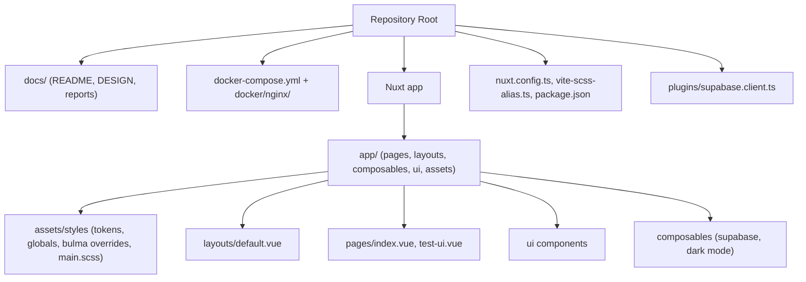

# Supablog — Nuxt 3 + Bulma + Supabase

Stack listo con Vue 3, Vite, Nuxt, Bulma/SCSS y Supabase dockerizado.

## Requisitos

- Node/NPM (se usa `npm`)
- Docker + Docker Compose

## Configuración rápida

1. Copia el entorno y ajusta claves si lo necesitas:

```bash
cp .env.example .env
```

2. Levanta Supabase local (API + Postgres + Auth + Realtime + Storage + Studio):

```bash
docker compose up -d
```

Servicios expuestos:

- API Gateway: http://localhost:54321 (rest/auth/realtime/storage)
- Studio: http://localhost:54323
- Postgres: localhost:5432

3. Instala dependencias y corre Nuxt:

```bash
npm install
npm run dev
```

Las variables `SUPABASE_URL` y `SUPABASE_ANON_KEY` se leen desde `.env` vía `runtimeConfig.public`.

## Arquitectura

### Project Map

El proyecto se estructura en las siguientes áreas principales:

- **Dockerized Supabase stack**: Postgres local más REST/Auth/Realtime/Storage/Studio detrás de un gateway nginx para acceso a la API en desarrollo.
- **Nuxt app shell**: Mapeo de directorios personalizado para pages/layouts/composables/plugins bajo `app/`, con soporte de alias Vite y preprocesamiento SCSS.
- **Supabase client integration**: Plugin y composable de Nuxt solo-cliente que inyectan y protegen un cliente Supabase compartido desde la configuración en tiempo de ejecución.
- **Design system & UI primitives**: Tokens SCSS → variables CSS, override de tipografía Bulma, snippets de UI temáticos (ribbons, dividers, classifieds box) y una página de prueba de UI.
- **Pages/layout & dark-mode experience**: Página de inicio básica más un showcase de UI de prueba, envuelto por un layout con un toggle persistente de modo oscuro vinculado a variables CSS.

### Diagrama lógico



### Diagrama estructural



Para un análisis detallado de la arquitectura, componentes clave y decisiones de diseño, consulta el [Project Report más reciente](docs/reports/project/LATEST.md).

## Scripts útiles

- `npm run dev` — modo desarrollo con Vite
- `npm run build` — build de producción
- `npm run preview` — previsualiza el build
