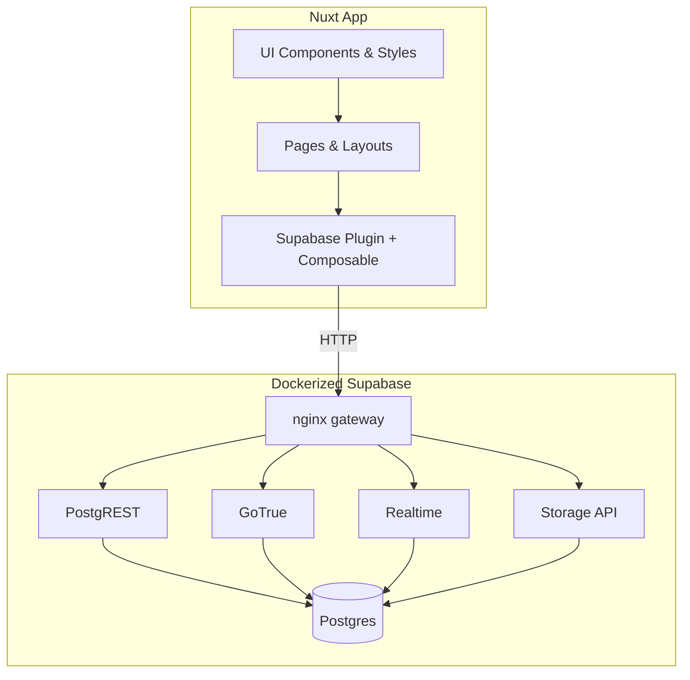

## Analysis Log — 2025-12-18 04:23:37 -05

Analyzed Area:
- Theming performance

Scope:
- Reviewed font loading, dark-mode initialization, and CSS variable application to gauge perceived performance and flicker risk.

Findings:
- Google Fonts load via a single `<link>` without preconnect/preload or `font-display`, so first paint may block or reflow, causing FOUT/CLS on slow links.
- Dark mode applies client-side after mount (media query/localStorage), meaning dark-preference users likely see a light flash before the toggle runs.
- Theme values are recomputed on the test page via `setTimeout` after toggles; small cost, but no debounce—unneeded work if toggling rapidly.

Implications:
- Security: none — purely client rendering concerns.
- Ops: low — no infra impact; only affects perceived UX.
- Compatibility: low — standard browser features; older browsers just ignore `prefers-color-scheme`.
- User-facing: medium — visible flashes or layout shifts degrade perceived quality and clarity of the theme.

Notes:
- Consider preconnecting to `fonts.googleapis.com`/`fonts.gstatic.com`, adding `font-display: swap`/preload for key fonts, and initializing theme on SSR/head (e.g., inline script to sync class before hydration) to avoid flashes.

Supablog Project Report

Summary:

- Nuxt-based blog prototype with a local Supabase stack (Postgres + REST/Auth/Realtime/Storage) orchestrated by Docker Compose and fronted by an nginx gateway.
- Report covers frontend structure (routes/layouts/components), Supabase client integration, SCSS-based design system, and operational entry points observed in-repo.
- No tracked code changes since the last report; working tree is dirty due to untracked files, but fingerprint matches the previous report (docs/reports excluded).

Repo Fingerprint:

- HEAD: 75f4695de08b324f31bcbfd09d72137ee38ed05b
- Working tree: dirty (untracked: AGENTS.md, docs/reports/)
- Fingerprint: 3b916ed72aa032c9b94c23a2d7b130303826523f
- Generated at: 2025-12-18 04:18:27 -05

Project Map:

- Dockerized Supabase stack: Local Postgres plus REST/Auth/Realtime/Storage/Studio behind a single nginx gateway for dev API access.
- Nuxt app shell: Custom directory mapping for pages/layouts/composables/plugins under `app/`, with Vite alias support and SCSS preprocessing.
- Supabase client integration: Client-only Nuxt plugin and composable that inject and guard a shared Supabase client from runtime config.
- Design system & UI primitives: SCSS tokens → CSS variables, Bulma typography override, themed UI snippets (ribbons, dividers, classifieds box) and a test UI page.
- Pages/layout & dark-mode experience: Basic home page plus a test UI showcase, wrapped by a layout with a persistent dark-mode toggle tied to CSS variables.

Key Components:

- docker-compose.yml: Defines Supabase-like services (db, rest, auth, realtime, storage, meta, api, studio) with host ports 5432/54321/54323 and volumes for Postgres + storage.
- docker/nginx/supabase.conf: Routes gateway requests to internal services (REST/Auth/Realtime websocket upgrade/Storage) following Supabase endpoint conventions.
- nuxt.config.ts + vite-scss-alias.ts: Configures Nuxt dirs to `app/*`, injects Google Fonts, exposes `runtimeConfig.public.supabaseUrl/supabaseAnonKey`, and resolves SCSS/component aliases for Vite.
- plugins/supabase.client.ts + app/composables/useSupabaseClient.ts: Builds a browser Supabase client from runtime config, injects it into Nuxt, and enforces availability via a typed accessor.
- app/assets/styles/*: SCSS token layer (`_colors.scss`) → CSS vars (`_globals.scss`), Bulma typography overrides, reset, mixins, and the main entry `main.scss` loaded by Nuxt.
- app/layouts/default.vue + app/composables/useDarkMode.ts: Layout wraps pages with a fixed dark-mode toggle; composable syncs system preference, localStorage, and CSS variables.
- app/pages/test-ui.vue + app/ui/*.vue: Showcase page renders color palettes, fonts, and small themed components (`ClassifiedsRibbon`, `ArrowDivider`, `ClassifiedsBox`) in light/dark modes.

Operational Notes:

- Setup: `cp .env.example .env`, `docker compose up -d` to start Supabase gateway on http://localhost:54321 (Studio on 54323, Postgres on 5432), then `npm install` and `npm run dev` for Nuxt.
- Runtime config: SUPABASE_URL and SUPABASE_ANON_KEY are pulled into `runtimeConfig.public` and exposed client-side by design.
- Styling: Google Fonts are loaded via `<link>` in `nuxt.config.ts`; Bulma is imported with typography config only to avoid color overrides.
- Dev tooling: Nuxt devtools enabled; Vite SCSS alias plugin resolves `@styles`/`@components` paths inside SCSS imports.

Risks / Implications:

- Security: medium — Local stack exposes Postgres on the host and ships example JWT/service keys; client-side anon key exposure is intentional but needs production guidance.
- Ops: low — Standard Node + Docker Compose workflow; images are version-pinned but multi-container stack increases startup surface slightly.
- Compatibility: low — Nuxt `compatibilityDate` and Supabase image tags are fixed; upgrades require coordinated bump/testing.
- User-facing: low — Frontend is prototype-level with minimal content and no end-to-end Supabase-backed blog flows yet.

Verification:

- Read: README.md, nuxt.config.ts, vite-scss-alias.ts, docker-compose.yml, docker/nginx/supabase.conf, plugins/supabase.client.ts, app/composables, app/layouts/default.vue, app/pages/test-ui.vue, app/assets/styles/*, docs/DESIGN.md.
- Repo fingerprint computed from tracked files excluding `docs/reports/project/`; no builds or runtime commands executed.

Follow-ups:

- Define the blog data model and decide where schema/migrations live (SQL files, Supabase CLI, etc.).
- Document production env guidance (separating dev/service keys, host exposure choices, JWT secret handling).
- Connect UI components/pages to real Supabase data and expand routing beyond the test showcase.
- Consider tightening Postgres exposure for dev (Docker-network-only) or documenting why host exposure is desired.

## Area Analyses

### Dockerized Supabase stack
- Purpose: Provide a full Supabase-like backend locally for API/auth/storage testing without SaaS dependency.
- Responsibilities: Run Postgres, PostgREST, GoTrue auth, Realtime, Storage API, pg-meta, and route them through an nginx gateway.
- Key files: docker-compose.yml; docker/nginx/supabase.conf.
- Design choices: Uses official Supabase/PostgREST/GoTrue images with pinned tags; exposes gateway and Postgres on host ports; nginx mirrors Supabase path structure.
- Constraints: Requires Docker; expects env secrets in .env; storage uses local volume backend; no migrations/seed files shipped.
- Trade-offs: Full local parity vs heavier startup/resources; host port exposure eases testing but increases accidental access risk.

### Nuxt app shell & build tooling
- Purpose: Bootstrap the frontend with Nuxt 3/4 structure tailored to the `app/` directory layout and SCSS aliases.
- Responsibilities: Configure directories, global CSS entry, fonts, runtime config, Vite alias/plugin wiring, and component auto-import path.
- Key files: nuxt.config.ts; vite-scss-alias.ts; package.json scripts.
- Design choices: Custom dir mapping (`app/pages`, `app/layouts`, etc.) and explicit absolute paths; SCSS alias plugin resolves `@styles`/`@components` partials.
- Constraints: Directory moves must be mirrored in config; SCSS files rely on alias resolution; fonts depend on Google CDN availability.
- Trade-offs: Clarity and explicit paths vs divergence from Nuxt defaults that newcomers might expect; SCSS alias plugin improves DX but adds a custom resolver surface.

### Supabase client integration
- Purpose: Provide a shared, typed Supabase client to Vue components without recreating it per call.
- Responsibilities: Read runtime config, instantiate Supabase client in the browser, inject `$supabase`, and gate usage via a composable.
- Key files: plugins/supabase.client.ts; app/composables/useSupabaseClient.ts.
- Design choices: Client-only plugin; warns when config missing; throws early if client unavailable.
- Constraints: Requires SUPABASE_URL/ANON_KEY at runtime; no SSR/server-side client provided; no auth/session helpers yet.
- Trade-offs: Early failure improves visibility of misconfig vs graceful degradation; plugin centralization avoids duplication but leaves SSR/data-fetch gaps.

### Design system & UI primitives
- Purpose: Establish a consistent “newspaper” aesthetic with light/dark palettes, typography, and small themed components.
- Responsibilities: Define SCSS tokens, emit CSS variables, integrate Bulma typography, load fonts, and provide reusable UI snippets.
- Key files: app/assets/styles/_colors.scss, _globals.scss, _bulma-overrides.scss, main.scss; app/ui/*.vue; app/pages/test-ui.vue.
- Design choices: Tokens in HSL mapped to CSS vars toggled by `body.dark`; Bulma imported with typography only; fonts via Google; UI components consume CSS vars.
- Constraints: Depends on client-side font loading; dark mode tied to `body` class; no theming API beyond CSS vars; components are presentational only.
- Trade-offs: High visual control via CSS vars vs limited reuse of Bulma components/themes; Google Fonts provide style but add external dependency and FOUT risk.

### Pages, layout, and dark-mode experience
- Purpose: Provide the UX shell and demo surfaces for testing styles/components.
- Responsibilities: Layout wrapping pages with dark-mode toggle, home page placeholder, and a UI test page showing palettes/fonts/components.
- Key files: app/layouts/default.vue; app/pages/index.vue; app/pages/test-ui.vue; app/composables/useDarkMode.ts.
- Design choices: Floating toggle uses `useDarkMode` composable synced to media query + localStorage; test page uses computed CSS var reads to display live values.
- Constraints: No actual blog routes/content yet; dark mode initialized client-side only (no SSR hydration guard beyond composable checks).
- Trade-offs: Immediate visual feedback for theming vs missing production UX flows; client-only init keeps code simple but may flicker before hydration.

## Synthesis

- Architectural observations: Frontend and backend are loosely coupled via runtime-configured URL/key, allowing the Nuxt app to target the Docker gateway without embedding service-role secrets.
- Cross-cutting concerns: Env management affects both docker-compose and Nuxt runtime config; CSS variable theme drives all UI components and dark-mode logic; reliance on Google Fonts impacts perceived load.
- Limitations/risks: No persistence schema or migrations tracked; Postgres exposure on host may be undesirable in shared dev environments; Supabase client is browser-only, so SSR/data fetching pathways are unimplemented.

## Diagrams

### Logical Diagram


### Structural Diagram
```mermaid
graph TD
  Repo[Repository Root]
  Repo --> Docs[docs/ (README, DESIGN, reports)]
  Repo --> Backend[docker-compose.yml + docker/nginx/]
  Repo --> Frontend[Nuxt app]
  Repo --> Config[nuxt.config.ts, vite-scss-alias.ts, package.json]
  Frontend --> AppDirs[app/ (pages, layouts, composables, ui, assets)]
  AppDirs --> Styles[assets/styles (tokens, globals, bulma overrides, main.scss)]
  AppDirs --> Layouts[layouts/default.vue]
  AppDirs --> Pages[pages/index.vue, test-ui.vue]
  AppDirs --> UIComponents[ui components]
  AppDirs --> Composables[composables (supabase, dark mode)]
  Repo --> Plugins[plugins/supabase.client.ts]
```

## Functional File Inventory

- Backend stack definition: docker-compose.yml; docker/nginx/supabase.conf — grouped as they provision and route the Supabase-like services.
- Frontend configuration: nuxt.config.ts; vite-scss-alias.ts; package.json — grouped for build/runtime setup and aliasing.
- Supabase integration: plugins/supabase.client.ts; app/composables/useSupabaseClient.ts — grouped for client creation and access control.
- Styling system: app/assets/styles/_colors.scss, _globals.scss, _bulma-overrides.scss, _mixins.scss, _reset.scss, _fonts.scss, main.scss — grouped as the theming pipeline feeding CSS variables and global styles.
- UI shell and features: app/layouts/default.vue; app/composables/useDarkMode.ts; app/pages/index.vue; app/pages/test-ui.vue; app/ui/*.vue — grouped as the rendered UX, theme toggle behavior, and demo components.
- Documentation: README.md; docs/DESIGN.md — grouped as reference material for setup and design language.

## Analysis Recommendations

- Supabase security/exposure: Validate whether Postgres and gateway ports should remain host-exposed for all devs; risk of unintended access with shared networks.
- Data model & migrations: Define schema ownership (SQL files or Supabase CLI) to avoid drift between environments; risk of implicit DB state.
- Frontend–backend integration: Wire actual blog data flows (auth, posts list/detail) to test the plugin/composable paths; risk that client-only integration leaves SSR/data-fetch gaps.
- Theming performance: Evaluate font loading and dark-mode flicker on slow connections; risk of layout shift and inconsistent initial render.

## Deep-Dive Prompt

Do you want to run a deep analysis on any of these areas?
